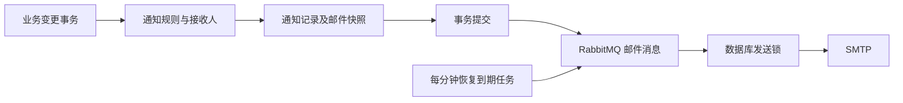

# 通知后端设计与业务规则

本轮先完善后端通知覆盖与可靠投递，前端保持现状。本文区分已实现规则与后续事项，作为新增业务通知的入口规范。

## 已实现的通知目录

| 类型 | 触发条件 | 接收人 | 偏好类别 |
| --- | --- | --- | --- |
| `COMMENT_PENDING_REVIEW` | 评论提交或编辑后等待审核 | 活跃管理员，排除评论作者 | 系统 |
| `COMMENT_FLAGGED` | 评论提交或编辑被内容策略标记 | 活跃管理员，排除评论作者 | 系统 |
| `COMMENT_APPROVED` | 评论审核通过 | 注册评论作者 | 评论 |
| `COMMENT_REJECTED` | 评论被驳回或标记为垃圾内容 | 注册评论作者 | 评论 |
| `COMMENT_REPLY` | 回复首次可见，包括管理员直接发布的回复 | 注册父评论作者，排除回复作者 | 评论 |
| `POST_COMMENT` | 文章评论首次可见 | 文章作者，排除评论作者及已收到回复通知的人 | 评论 |
| `MOMENT_COMMENT` | 动态评论首次可见 | 动态作者，排除评论作者及已收到回复通知的人 | 评论 |
| `GUESTBOOK_COMMENT` | 留言板消息可见且没有注册回复接收人 | 活跃管理员，排除留言作者 | 系统 |
| `COMMENT_REPORT_RECEIVED` | 成功创建一条新的评论举报 | 活跃管理员，排除举报人 | 系统 |
| `COMMENT_REPORT_RESOLVED` | 单条举报处理，或评论审核批量关闭其待处理举报 | 对应举报人 | 评论 |
| `POST_PENDING_REVIEW` | 文章提交审核 | 活跃管理员及编辑，排除作者 | 系统 |
| `POST_REJECTED` | 文章审核未通过 | 文章作者，附审核意见 | 系统 |
| `POST_PUBLISHED` | 文章发布，包括定时发布 | 文章作者 | 系统 |
| `POST_SCHEDULED` | 文章设置或调整发布时间 | 文章作者 | 系统 |
| `POST_SCHEDULE_CANCELED` | 取消定时发布 | 文章作者 | 系统 |
| `POST_ARCHIVED` | 已发布文章归档 | 文章作者，附归档原因 | 系统 |
| `CATEGORY_POST` | 关注分类的文章发布 | 活跃分类关注者，排除文章作者 | 分类更新 |
| `POST_REPORT_RECEIVED` | 成功创建一条新的文章举报 | 活跃管理员，排除举报人 | 系统 |
| `POST_REPORT_RESOLVED` | 待处理文章举报被处理 | 举报人 | 系统 |
| `FRIEND_LINK_APPLICATION` | 友链申请成功保存 | 活跃管理员；可选的独立审核邮箱 | 系统 / 独立业务邮件 |
| `FRIEND_LINK_APPROVED` | 友链申请通过审核 | 申请时填写的联系邮箱 | 独立业务邮件 |
| `FRIEND_LINK_REJECTED` | 友链申请未通过审核 | 申请时填写的联系邮箱 | 独立业务邮件 |
| `HEALTH_CHECK` | 已有链接健康检查发现失效链接 | 已有健康检查配置的管理员 | 系统 |

普通文章编辑、浏览、点赞、收藏、取消关注、审核重复请求不新增通知。文章发布和审核结果是作者的业务回执，允许作者收到自己的文章状态变化。

访客不创建注册用户站内通知，也不因为填写了评论邮箱就默认加入邮件投递。访客评论通过审核后，仍可通知注册回复对象、内容作者及留言板管理员。友链结果邮件使用申请者主动填写的联系邮箱，独立于账户的通知偏好。

管理员的站内和邮件通知遵守系统通知开关。`FRIEND_LINK_MODERATION_EMAIL` 是显式配置的独立工作邮箱；它不绑定账户偏好。如果同时配置为某位管理员的邮箱，并启用该管理员的系统邮件，同一申请可能收到工作邮箱提醒和账户提醒，部署时应选择一个入口。

## 生成与事务边界

评论和文章通知监听器使用 `BEFORE_COMMIT`，将通知及投递记录写入原业务事务。举报与友链服务直接在业务事务内写入通知。业务回滚时，通知与待发送邮件一同回滚；提交成功后才允许入队。

数据库通知写入失败会阻止原业务事务提交。这是当前版本对业务结果和通知一致性的选择。分类发布沿用批量插入，但邮件接收人的展开仍发生在该事务内；关注者数量明显增加时，需要改为持久化业务事件后分批展开，保留相同的一致性边界。

## 幂等规则

- 新业务入口调用 `sendOnce`，去重键由通知类型、事件标识、接收人构成，数据库唯一约束负责并发保护。
- 评论回复和内容作者提醒按评论 ID 去重。重复批准、重新审核、重放同一评论的通知处理，不重复提醒读者同一条评论。
- 评论审核结果和文章状态变化按事件实例 ID 去重；一次新的状态变化会产生新的回执。事件标识在事件对象创建时生成，不在监听器执行时生成。
- 举报按内容 ID 和举报人去重；重复举报和重复处理不生成第二条通知。
- 分类文章更新沿用文章 ID 和接收人去重；同一文章再次发布不重复提醒关注者。
- 用户邮件按通知 ID 去重，外部联系人邮件按业务事件键去重；唯一约束覆盖并发入队。
- 用户删除或清空已读通知，仅关闭站内可见性，保留去重键、历史记录和正在进行的邮件投递。收藏和已完成内容仍受原有清理条件保护。

偏好在生成时决定渠道，默认站内开启、邮件关闭。之后调整偏好不会撤销已经保存的邮件任务，也不会主动补发之前关闭渠道时的历史通知。

## 邮件状态与恢复

| 状态 | 含义 | 后续处理 |
| --- | --- | --- |
| `QUEUED` | 已保存，等待消息交给消费者 | 超过 10 分钟未被认领则重新入队 |
| `SENDING` | 消费者持有当前发送尝试 | 10 分钟租约到期后恢复；预算耗尽则终止 |
| `FAILED` | 入队或 SMTP 尝试失败 | 到 `next_attempt_at` 后重新入队 |
| `DELIVERED` | SMTP 调用成功，结果已保存 | 后续重复消息直接跳过 |
| `ABANDONED` | 已用完五次尝试预算 | 停止自动重试 |

投递记录保存收件地址、标题、正文和链接快照，重试不依赖通知实体仍可见。外部友链邮件允许没有账户通知记录。

消费端先通过数据库行锁认领，提交认领事务后才调用 SMTP。尝试编号单调增加，成功和失败回写同时检查状态及编号，避免旧消费者覆盖新的尝试或成功状态。

入队失败计入尝试预算；SMTP 认领计入尝试预算，完成回写不重复计数。失败退避为 2、4、8、16 分钟，第五次失败终止。调度器每分钟检查到期任务，因此恢复时间还受调度周期影响。通知任务由投递日志统一控制重试；密码、验证码与 Newsletter 等原有邮件保留原来的消费路径。

进程在保存任务后、消息发送前退出，任务可以恢复；重复消息、并发消费者和延迟回写不会无条件重复执行。SMTP 成功后、结果保存前进程退出，恢复仍可能再次发送。当前保证可恢复的投递，不承诺 SMTP 邮件严格只发送一次；`DELIVERED` 也不代表收件人已经阅读，或邮件一定到达收件箱。

邮件链接使用已有 `APP_BASE_URL` 对应的站点地址补全，拒绝将其他站点链接作为应用链接发送。投递错误记录仅保存异常类别，避免保存异常中可能包含的凭证或私人信息。

## 数据迁移与验证

`V185__Harden_Notification_Delivery.sql` 给旧投递记录回填内容快照与恢复时间，增加外部邮件去重键与到期索引，并允许外部邮件没有 `notification_id`。发布必须先执行迁移，再启动新版本；升级期间不应混用新旧邮件消费者。

测试覆盖业务提交与回滚、提交前生成的邮件事件在提交后触发、并发生成、并发消费、隐藏后重放、发送失败、预算耗尽、过期任务恢复、旧尝试回写，以及评论、文章、举报和友链通知规则。自动化测试使用模拟 SMTP，不发送真实邮件。

## 投递运维、上下文与精细偏好

`V186__Notification_Operations_Context_And_Preferences.sql` 为通知补充对象类型、对象 ID、操作者 ID 和建议动作，为投递补充尝试上限与入队批次，并新增类别偏好和手动重试审计表。发布必须先执行 `V185` 与 `V186`，再启动新版本。

管理员接口位于 `/api/v1/admin/notifications/deliveries`，需要 `ADMIN` 角色。列表和详情只返回渠道、状态、尝试次数、错误类别、时间和关联上下文，不返回收件地址、正文或去重键。手动重试只接受 `FAILED` 与 `ABANDONED`；它保留已有尝试编号，把剩余预算补到至少五次，并按客户端请求 ID 去重。同一请求重复提交不会再次提高预算或再次入队。较早入队失败的回调必须带上当时的入队批次，批次不一致时不得改写当前任务。

通知上下文目前覆盖文章、评论和友链。动作分为查看、审核、编辑和审核举报。对象 ID 只表示导航意图，不授予资源访问权限。管理链接仍是后台路由意图，具体筛选与打开行为留给前端。

精细偏好有六个类别：评论、分类更新、创作回执、审核任务、举报、运维。未写入类别行时继承原有三个开关；创作回执、审核、举报和运维继承系统开关。替换接口按提交的类别全集覆盖，省略的类别恢复继承。偏好仍在生成时决定渠道。工作邮箱去重仍使用独立的外部邮件键，不并入账户偏好。

## 进入前端阶段前的后续工作

1. 前端接入通知上下文与精细偏好接口，并把管理链接落到具体筛选与打开行为。
2. 规模与保留策略：分类关注者分批展开、工作提醒聚合、历史记录保存期限、到期去重墓碑和投递日志清理规则。

后续通知候选应建立在实际业务变化之上：看板任务首次分配或负责人变化、临近截止与逾期、定时发布任务失败、Webhook 持续失败、Newsletter 广播大量失败、动态同步失败。优先通知可以采取行动的负责人；高频失败先按任务聚合，再在恢复时关闭对应提醒。当前这些候选尚未接入，避免把现有功能误记为已完成。
